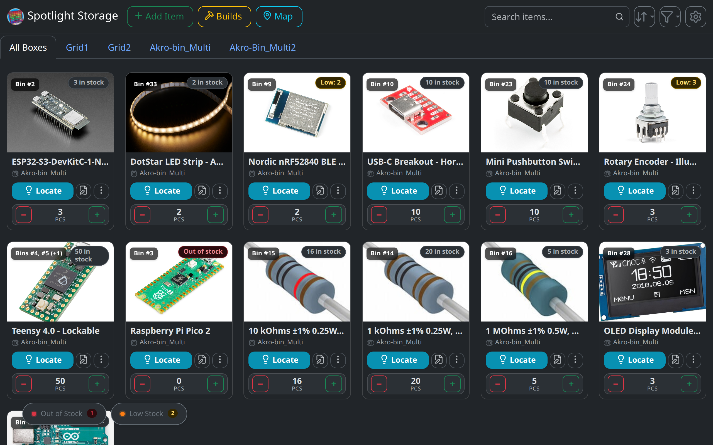
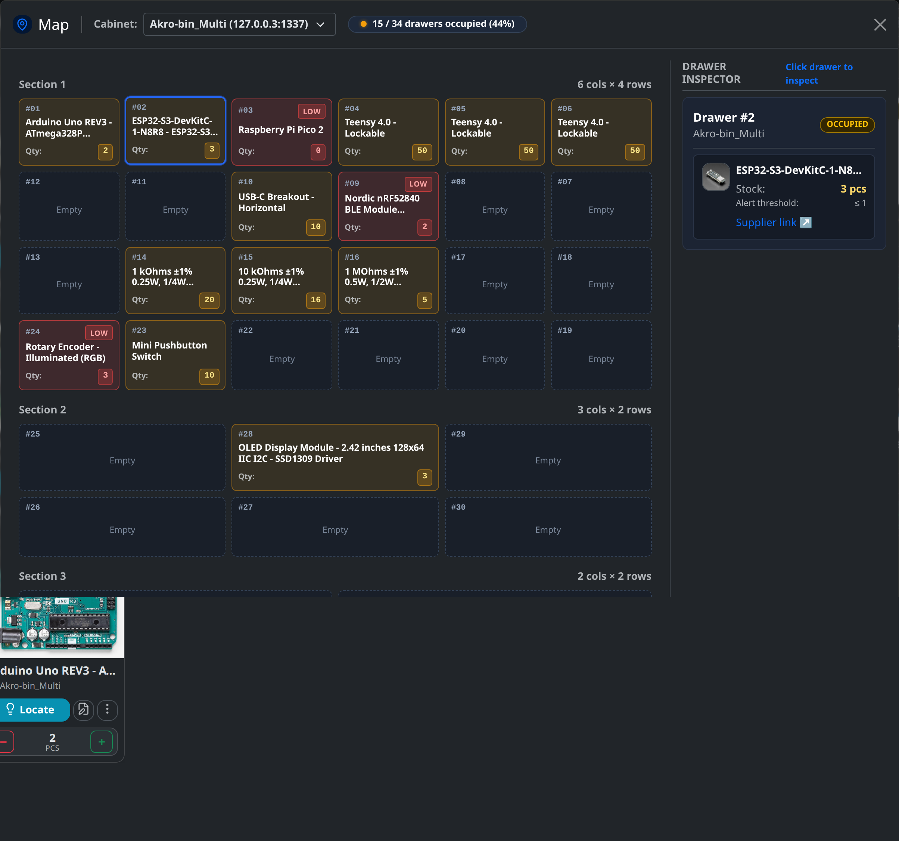
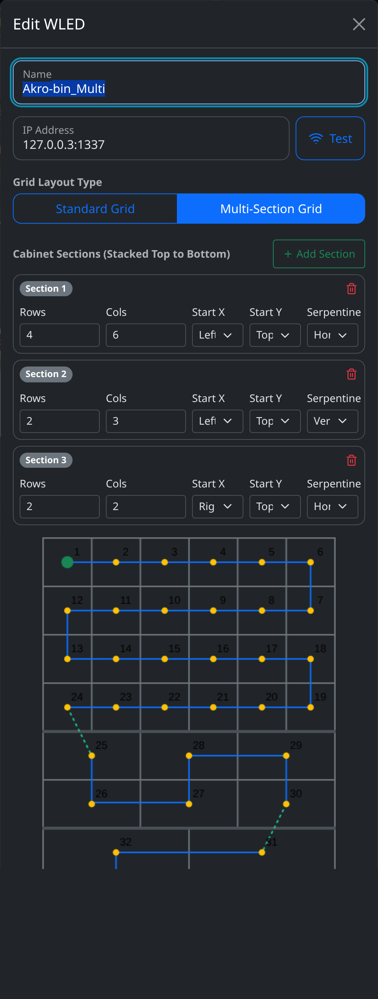
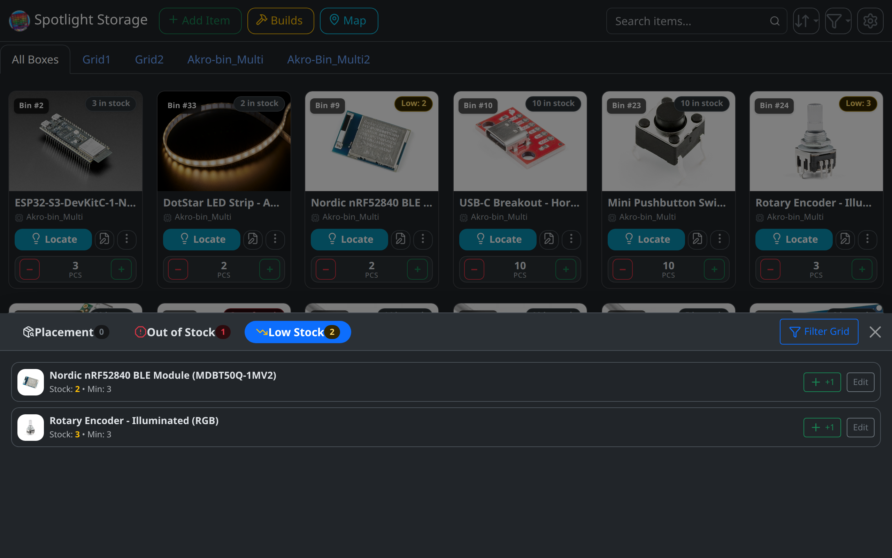
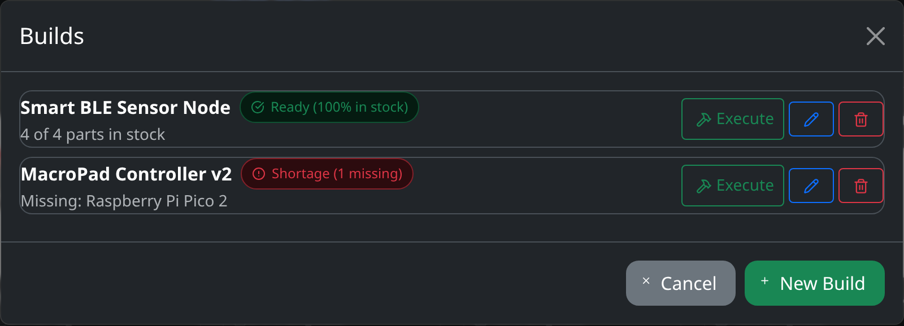
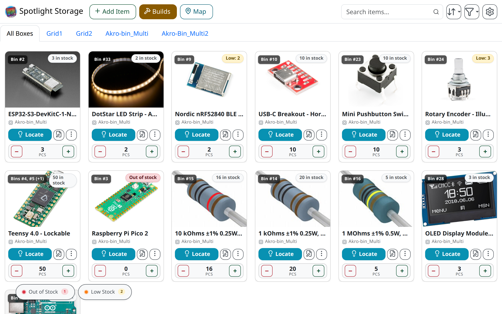

<!-- TODO: replace with final logo once designed -->


# Spotlight Storage
> Smart Parts Storage with WLED & Addressable LEDs

[](#testing--quality)
[](#system-requirements)
[](#quick-start)
[](#hardware--wiring)
[](#quick-start)
[](LICENSE)



---

## What is Spotlight Storage?
Spotlight Storage bridges the gap between digital inventory and physical organization. By embedding addressable RGB LEDs inside your drawer bins, this system visually guides you to the exact part you need. Simply search for an item in the web interface, and the corresponding drawer physically lights up in your workspace. This fork extends the concept with multi-tier cabinets, inventory health tracking, build recipes, and a production-ready self-hosted architecture.

---

## How This Fork Differs
This project is built on the foundation of FireMarshmellow/Spotlight_Storage and has grown into a substantially more capable, production-ready system.

| Feature | Original | This Fork | Learn More |
|---------|----------|-----------|------------|
| Deployment | Windows only | Linux, macOS, Windows, Docker Compose | [Deployment Guide](docs/deployment_and_backups.md) |
| Cabinet types | Single-section grid only | Single & multi-section (arbitrary tier count) | [Cabinet Configuration](docs/cabinet_configuration.md) |
| Inventory health | None | Three-tier pill system (Unassigned / Low Stock / Out of Stock) | [Inventory Health](docs/inventory_health.md) |
| Builds / BOM recipes | None | Full build & recipe system with readiness tracking and stock deduction | [Builds & Recipes](docs/builds_and_recipes.md) |
| Map inspector | None | Interactive drawer map with per-bin inspector panel | [Cabinet Configuration](docs/cabinet_configuration.md) |
| Image management | None | Built-in uploader, unconstrained crop, 90° rotation, & aspect ratio presets | — |
| Tag system | Basic | AND/OR match modes with relevance-ranked results | — |
| External dependencies | CDN-loaded libraries | 100% offline — all frontend libraries vendored locally | — |
| Automated tests | None | 178 tests (unit, integration, security, Playwright UI) | [Test Suite](tests/README.md) |
| Security hardening | None | SSRF protection, path traversal defense, secure HTTP headers, non-root Docker | — |
| Languages | 1 (English) | 6 (EN, DE, FR, NL, FI, PL) | [Multilingual Guide](docs/multilingual.md) |
| Documentation | Minimal | Full docs suite (hardware, API, deployment, builds, i18n) | [Documentation](#documentation) |

---

## Feature Highlights

### 🗺 Interactive Drawer Map & Bin Inspector
<!-- screenshot: map-inspector.png -->

Visually navigate your full cabinet layout. Click any bin to see exactly which part is stored there, its quantity, and its status — without touching the main inventory list.

### 🏗 Multi-Section Cabinet Builder
<!-- screenshot: cabinet-sectioning.png -->
<div align="center">
  
</div>

Configure cabinets with multiple drawer tiers — each with its own row/column count, serpentine direction, and routing corner. A live canvas preview shows the proportional layout and inter-section wiring path.

### 📦 Inventory Health System
<!-- screenshot: inventory-health-drawer.png -->

Three smart status pills track unassigned parts, low-stock alerts, and zero-quantity shortfalls. Clicking a pill opens a bottom drawer listing every affected part for immediate action.

### 🔨 Builds & BOM Recipes
<!-- screenshot: builds-modal.png -->
<div align="center">
  
</div>

Create named project builds listing the exact parts and quantities needed. Real-time readiness badges show "Ready (100%)" or "Shortage" per build. One click atomically deducts all parts from stock.

### 🏷 Tag Filtering & Relevance Sorting
Filter your inventory by one or more tags using **Any (OR)** or **All (AND)** match mode. Results are automatically ranked by the number of matching tags — the most relevant parts surface first.

### 📸 Built-In Image Uploader, Cropper & Rotation
Upload part photos directly in the browser or paste external image URLs. The integrated editing modal provides unconstrained / freeform cropping, aspect ratio presets (Free, 1:1, 4:3), 90° rotation controls, and a Full Image toggle to rotate without cropping.

### 🌙 / ☀️ Light & Dark Mode
<!-- screenshot: main-dashboard-light.png -->

Clean Bootstrap 5 interface with automatic theme detection and manual override. Works equally well in a dark workshop at night or under bright overhead lighting.

---

## Hardware & Wiring

| Component | Recommended | Alternatives |
|-----------|-----------|--------------|
| Microcontroller | ESP32-C3 | ESP8266, ESP32, ESP32-S3 |
| LED Strip | WS2812B (5V) | SK6812, WS2815 (12V) |
| Level Shifter | 74AHCT125 | SN74HCT245 |
| Power Supply | 5V ≥ 3A (≥30 LEDs) | Scale with LED count |

### WLED Setup (4 Steps)
1. Flash WLED via the [Web Installer](https://install.wled.me/).
2. Connect the ESP to your Wi-Fi network.
3. Open the ESP's IP in a browser → `Config → LED Preferences` → set GPIO pin and LED count.
4. Enter the ESP's IP in Spotlight Storage Settings → click **Test** to verify.

> [!NOTE]
> The videos below reference an older version of the UI, but the physical wiring and WLED configuration they demonstrate remain accurate.
> - [Main setup video](https://youtu.be/7C4i-2IqSS4)
> - [Step-by-step video](https://youtu.be/QOd1apc0Lpo)

For complete wiring schematics, power injection math, level shifting, and multi-section routing details → **[Hardware & Wiring Guide](docs/hardware_and_wiring.md)**

---

## Quick Start

### Option A — Linux & macOS
```bash
git clone https://github.com/mkrugh/Spotlight_Storage.git
cd Spotlight_Storage
./container.sh start
```
Open **http://localhost:5000**

Available commands:
```bash
./container.sh start    # Build and start
./container.sh stop     # Stop container
./container.sh restart  # Restart container
./container.sh status   # Health check
./container.sh logs     # Live log tail
./container.sh rebuild  # Rebuild after updates
./container.sh test     # Run smoke tests inside container
```

### Option B — Windows
1. Install [Docker Desktop](https://www.docker.com/products/docker-desktop/).
2. Download or clone this repository.
3. Double-click `install.bat`.
4. Open **http://localhost:5000**.
5. To stop/remove without losing data: run `uninstall.bat`.

### Option C — Docker Compose
```bash
docker compose up -d
```

### Option D — Docker Run
```bash
docker run -d \
  --name SpotlightStorage \
  --restart unless-stopped \
  -p 5000:5000 \
  -v ./data:/app/data \
  -v ./images:/app/images \
  -v ./logs:/app/logs \
  -v ./static/translations:/app/static/translations:ro \
  -e TRANSLATIONS_DIR=/app/static/translations \
  spotlight-storage:dev
```

### LAN Access
Open `http://<your-host-ip>:5000` from any phone, tablet, or device on your local network.

> [!TIP]
> **Your data lives in `data/` and `images/`** — back up these two folders to preserve everything. See the [Deployment & Backup Guide](docs/deployment_and_backups.md) for full backup and upgrade procedures.

---

## REST API & Automations

Spotlight Storage exposes a RESTful API for scripting, Home Assistant automations, Node-RED flows, and hardware integrations.

| Endpoint group | Base path |
|---|---|
| Parts inventory | `/api/items` |
| WLED controllers | `/api/esp` |
| Build recipes | `/api/builds` |
| Tags | `/api/tags` |
| Settings | `/api/settings` |

> [!IMPORTANT]
> All mutating requests (POST, PUT, DELETE) require `Content-Type: application/json`.

Example — locate a part's LEDs:
```bash
curl -X POST http://localhost:5000/api/items/3 \
  -d "action=locate"
```

For the full API specification with payload schemas, response shapes, and curl examples → **[API Reference](docs/api_reference.md)**

---

## Testing & Quality

178 automated tests covering unit logic, database operations, REST endpoints, WLED LED pulse behaviour, security constraints, concurrency, and Playwright UI flows.

```bash
# Run full test suite
pytest

# Container smoke test
./container.sh test
```

For test architecture, module breakdowns, and coverage details → **[tests/README.md](tests/README.md)**

---

## Documentation

| Guide | Description |
|-------|-------------|
| [Hardware & Wiring](docs/hardware_and_wiring.md) | Component selection, LED wiring, level shifting, power injection, WLED setup |
| [Cabinet Configuration](docs/cabinet_configuration.md) | Single & multi-section setup, serpentine parameters, bin numbering |
| [Inventory Health](docs/inventory_health.md) | Min quantity thresholds, status pills, placement drawer, stocktaking mode |
| [Builds & BOM Recipes](docs/builds_and_recipes.md) | Project builds, readiness tracking, atomic stock deduction |
| [API Reference](docs/api_reference.md) | Full REST API spec, curl examples, Home Assistant & Node-RED integration |
| [Deployment & Backups](docs/deployment_and_backups.md) | Docker options, data persistence, backup/restore, reverse proxy, HTTPS |
| [Multilingual Guide](docs/multilingual.md) | Translation file structure, adding languages, editing strings |
| [Test Suite](tests/README.md) | Automated test architecture and coverage |

---

## System Requirements

| Requirement | Minimum |
|---|---|
| Python | 3.11+ |
| Docker | 20.10+ |
| Docker Compose | v2+ |
| WSGI Server | Waitress (bundled) |
| Browser | Any modern browser (Chrome, Firefox, Safari, Edge) |

---

## Credits & Acknowledgements

Spotlight Storage was originally created by [FireMarshmellow](https://github.com/FireMarshmellow) as part of the [M.I.M.O.S.A project](https://github.com/FireMarshmellow/M.I.M.O.S.A) (Mellow Labs Inventory Management and Organization System Apparatus). This fork builds on that foundation with substantial new features, architecture improvements, and a complete documentation suite.

- [Original Spotlight Storage](https://github.com/FireMarshmellow/Spotlight_Storage) by FireMarshmellow
- [WLED](https://kno.wled.ge/) — the open-source LED firmware that powers the physical lighting

---

## License

[MIT](LICENSE)
