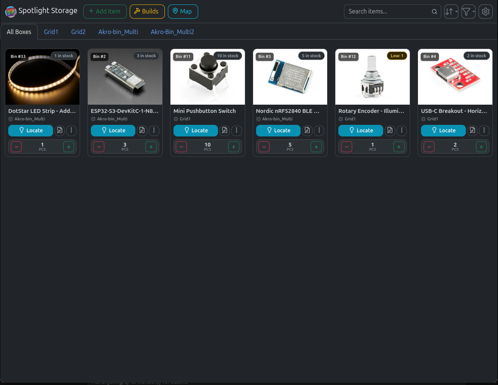

# Spotlight Storage - The easy way to find your parts


## About this fork

This is a modernized fork of [FireMarshmellow/Spotlight_Storage](https://github.com/FireMarshmellow/Spotlight_Storage) (originally from [Mellow Labs / M.I.M.O.S.A](https://github.com/FireMarshmellow/M.I.M.O.S.A)).

This fork modernizes the codebase, enhances usability, strengthens security, adds Linux container automation, and includes a full automated test suite.

---

## Features

- **Multi-Section Drawer Cabinets**: Configure mixed-size drawer organizers (e.g. Akro-Mils or custom multi-tier cabinets with smaller drawers on top and wider drawers on bottom) wired as a single sequential WLED matrix with arbitrary sections and column counts.
- **Visual Inventory Management**: Organize parts with custom names, quantities, direct image uploads (with built-in cropping tool), tags, and supplier links.
- **WLED ESP Controller Integration**: Seamlessly connect any WS2812 or compatible addressable LED strips and matrix panels running [WLED](https://kno.wled.ge/).
- **ESP Connection Testing & Status**: Dedicated "Test" button in ESP settings with live status indicator and an automated double-flash LED confirmation pulse. Supports custom hostnames and ports.
- **Real-Time LED Map View**: Visual grid layout showing occupied and empty LED positions across all controllers. Automatically refreshes without page reloads when inventory changes.
- **Bidirectional Sorting**: Sort parts by Name, Quantity, or LED Position in either Ascending (A–Z, 0–9) or Descending (Z–A, 9–0) order with natural alphanumerical sorting.
- **Builds & Recipes**: Create named multi-part builds with specified quantities; deduct all required parts from stock simultaneously with a single click.
- **Stocktaking Mode**: Rapid inventory audits with direct quantity input and increment/decrement buttons.
- **Multi-Location Storage**: Manage multiple ESP controllers in different rooms or workshops over local Wi-Fi.
- **Multilingual Support**: Fully translated into 6 languages: English, German, French, Dutch, Finnish, and Polish.
- **Light & Dark Mode**: Clean Bootstrap 5 interface with responsive theme switching.
- **Security Hardened**: Built-in SSRF protection, strict path traversal defense, file type verification, secure HTTP headers, and non-root Docker container execution.
- **Tag Filtering & Relevance Sorting**: Filter inventory with configurable "Match Any (OR)" or "Match All (AND)" logic, ranking items by match relevance (highest matching tags first) with instant tag list synchronization.
- **Automated Test Suite**: 148 automated unit, integration, and build sanity tests.

---

## Multi-Section Drawer Cabinet Wiring & Setup

Many storage organizers (such as Akro-Mils, Stanley, or custom 3D-printed modular cabinets) combine different drawer sizes in a single physical unit—for example, small drawers on top (6 columns) and wide double-width drawers on the bottom (3 columns), or three tiers of varying column counts.

Spotlight Storage supports **arbitrary $N$-section cabinets** on a single continuous WS2812 LED strip or WLED controller.

### Wiring Topology: Sequential Section-by-Section

The data line runs through Section 1 first, weaves across all its rows, exits, and then jumps down to enter Section 2, continuing sequentially through all remaining sections.

#### Example: 2-Tier Cabinet (Top: 6 cols × 4 rows; Bottom: 3 cols × 2 rows)

```text
======================= SECTION 1 (6 cols x 4 rows = 24 LEDs) =======================
  [DIN from ESP]
        │
       (1)  ──>  (2)  ──>  (3)  ──>  (4)  ──>  (5)  ──>  (6)   [Row 0: Left to Right]
                                                            │
       (12) <──  (11) <──  (10) <──  (9)  <──  (8)  <──  (7)   [Row 1: Right to Left]
        │
       (13) ──>  (14) ──>  (15) ──>  (16) ──>  (17) ──>  (18)  [Row 2: Left to Right]
                                                            │
   ┌── (24) <──  (23) <──  (22) <──  (21) <──  (20) <──  (19)  [Row 3: Right to Left]
   │
   │   [Sequential Jumper Wire drops from Section 1 exit to Section 2 entry]
   │
===│=================== SECTION 2 (3 cols x 2 rows = 6 LEDs) =======================
   └──>(25) ───────>───────> (26) ───────>───────> (27)        [Row 0: Left to Right]
                                                    │
       (30) <───────<─────── (29) <───────<─────── (28)        [Row 1: Right to Left]
        │
      [DOUT / End of Strip]
```

### Wiring Notes & Rules:
1. **Drawer Numbering**: Bins are numbered sequentially along the physical data path ($1 \dots N$). In Section 1, drawers are numbered 1 to 24. In Section 2, drawers continue from 25 to 30.
2. **Transition Corners & Section Direction**:
   - An **even number of rows** (e.g. 4 rows) exits on the **same side** as the entry corner.
   - An **odd number of rows** (e.g. 3 rows) exits on the **opposite side**.
   - Each section in Spotlight Storage can independently configure its own **Start X** (`Left` or `Right`), **Start Y** (`Top` or `Bottom`), and **Serpentine Direction** (`Horizontal` or `Vertical`). This guarantees you can route jumper wires along the most convenient side of your cabinet without reversing LED indices.
3. **Arbitrary Column Counts & Section Count**: You can add 2, 3, 4, or more sections stacked vertically. Each section can have its own independent column and row count.

### Software Configuration:
1. Open **WLED Settings** (`+ Add WLED` or click the edit icon on an existing controller).
2. Under **Grid Layout Type**, select **Multi-Section Grid**.
3. Use **Add Section** to add tiers.
4. For each section, configure its **Rows**, **Cols**, **Start X**, **Start Y**, and **Serpentine** direction. The live preview canvas instantly renders the combined cabinet, showing proportional drawer sizes, serpentine routing lines, and the inter-section jumper connection.
5. Click **Save**. The LED map, item assignment grid, and WLED illumination logic will automatically handle all multi-section routing.

---

## Hardware Used

- **Microcontroller**: [ESP32-C3](https://www.amazon.de/Waveshare-Development-ESP32-S3FH4R2-Castellated-Applications/dp/B0CHYHGYRH/) (or any ESP8266 / ESP32 board)
- **LEDs**: [BTF-LIGHTING WS2812B Addressable LEDs](https://www.amazon.de/BTF-LIGHTING-Individuell-adressierbar-Vollfarbiger-DIY-Projekte/dp/B088BPGMXB/)

### Install WLED on ESP Devices
1. Visit the [WLED Web Installer](https://install.wled.me/) and flash the latest release to your ESP board.
2. Connect the ESP to your Wi-Fi network.
3. In a browser, open the ESP's IP address, navigate to `Config -> LED Preferences`, and configure your LED strip length and GPIO pin.
4. Add the ESP's IP address (and optional custom port) into Spotlight Storage's settings and click **Test** to verify connection.

---

## Getting Started & Installation

### Option A: Linux & macOS (using `container.sh`)

Spotlight Storage includes an automated helper script [`container.sh`](container.sh) for managing the Docker environment:

```bash
# Start container (builds image automatically if not found)
./container.sh start

# View real-time application logs
./container.sh logs

# Check container health and status
./container.sh status

# Rebuild container after pulling changes
./container.sh rebuild

# Stop container
./container.sh stop
```

Access the web interface at **`http://localhost:5000`**.

> [!NOTE]
> `container.sh` automatically detects if your user belongs to the `docker` group and handles active session elevation seamlessly.

---

### Option B: Windows (using `install.bat`)

1. Download or clone this repository to your computer.
2. Install and launch [Docker Desktop for Windows](https://www.docker.com/products/docker-desktop/).
3. Double-click `install.bat`. It will start Docker Desktop if needed, build the container, and launch the service.
4. Open **`http://localhost:5000`** in your browser.
5. To stop or remove the container without losing data, run `uninstall.bat`.

---

### Option C: Docker Compose

You can deploy using Docker Compose (requires Docker Compose v2+):

```yaml
services:
  spotlight-storage:
    container_name: SpotlightStorage
    build: .
    restart: unless-stopped
    ports:
      - "5000:5000"
    volumes:
      - ./data:/app/data
      - ./images:/app/images
      - ./logs:/app/logs
      - ./static/translations:/app/static/translations:ro
    environment:
      - TRANSLATIONS_DIR=/app/static/translations
```

Start the container:
```bash
docker compose up -d
```

---

### Option D: Docker Run

```bash
docker run -d \
  --name SpotlightStorage \
  --restart unless-stopped \
  -p 5000:5000 \
  -v ./data:/app/data \
  -v ./images:/app/images \
  -v ./logs:/app/logs \
  -v ./static/translations:/app/static/translations:ro \
  -e TRANSLATIONS_DIR=/app/static/translations \
  spotlight-storage:dev
```

---

## Network Access

To access Spotlight Storage from smartphones, tablets, or other devices on your local network:
1. Find the local IP address of the host machine (e.g., `192.168.1.100`).
2. Open `http://<your-host-ip>:5000` in any mobile or desktop browser.

---
 
## API Integration & Custom Scripts

Spotlight Storage provides RESTful endpoints (such as `/api/items`, `/api/esp`, `/api/builds`, and `/api/tags`) for third-party scripts, automations, or hardware integrations.

> [!NOTE]
> **Payload Format Requirement:** All mutating API requests (`POST`, `PUT`, `DELETE`) must send a JSON payload with the `Content-Type: application/json` HTTP header. Form-encoded data (`application/x-www-form-urlencoded`) is not accepted on mutating endpoints.

---

## Testing & Verification

Spotlight Storage includes a full automated test suite with **148 tests** covering unit math, database operations, REST endpoints, WLED pulses, security constraints, and build sanity.

Run the test suite locally with `pytest`:
```bash
pytest
```

Or run the container smoke test:
```bash
./container.sh test
```

For complete documentation on test architecture, module breakdowns, and test coverage, see [tests/README.md](tests/README.md).

---

## System Requirements

- **Python**: 3.11+ (Python 3.12 / Alpine 3.20 inside Docker)
- **WSGI Server**: Waitress (integrated for production concurrency)
- **Docker**: Version 20.10+ / Docker Compose v2+ (recommended for deployment)
